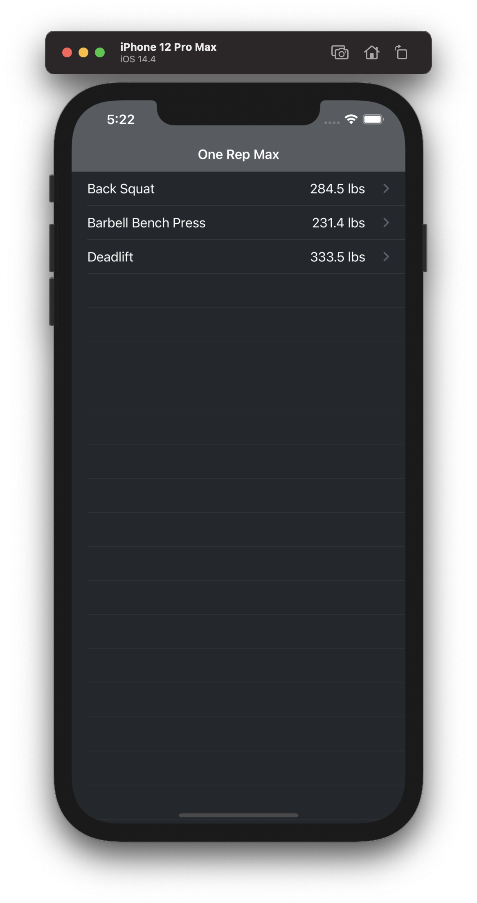

#  Workout Charts
 

Workout Charts is an application that is used to determine your projected one rep max based on historical data. The current implementation uses the Brzycki method to calculate your projected one rep max.

## Structure

This project uses SPM and contains two frameworks called `Business` and `App`. The `Business` framework contains all of the business logic to fetch/create the models that are necessary to capture data and calculate a projected one rep max. The `App` framework is a consumer of the `Business` framework and contains everything necessary to build the app.

### Business framework

The two primary services here are the `ExerciseService` and the `ExerciseIndexer`. 

The `ExerciseService` is responsible for downloading a data set (in CSV form) and creating an ORM that is easily consumable by a consumer. This is done asynchronously to maintain a responsive application either from a slow network or parsing a file on disk.

The `ExerciseIndexer` is used to cluster exercises together and calculate historical projected one rep maxes. The projected one rep max is calculated using the Brzycki method, the indexer takes the sets performed on a given day, calculates the one rep maxes of those sets and takes me maximum of all the sets to use as the projected one rep max.

### App framework

The `App` framework contains everything necessary to build the app. 

This app is built using UIKit. This was done to allow for easy backwards compatibility with iOS versions lower than 13 (specifically 11 since the fitbod app supports back to that OS version) but it was built and targeted for iOS 14.4. When we can deprecate iOS 12 I would recommend upgrading to SwiftUI and Combine.

The charting library that is currently being used is [Charts](https://github.com/danielgindi/Charts). This charting library was the most widely recommended during my research but I was unsure about whether or not it would meet our usecases as we continue to add more complex features. This is why you will see `ChartBuilder` and `LineChartWrapperView`. These classes are used to reduce the use of the Charts framework in our code in order to mitigate any issues that could arrise from having to swap out the charting library or building our own.

## Future Work

### Features

- Interactive Charts
    - Zooming and panning to be able to get more detailed information
    - Tapping on a data point should bring up more information about that data point
    - Haptic Feedback
- Localization
    - Support for metric
- File Upload
- Manual user editing
- Data export
- Light/Dark Mode support
- Add Error UI
- Add loading UI
- Accessibility
- Animations
- Landscape Charting View
- iPad Support

### Developer Features
- Error logging
- Add metrics tracking
- Add integration tests
- Add UI tests
- Upgrade to SwiftUI (pending iOS 12 depreciation)
- Replace closure API for Combine and/or async/await (pending iOS 12 depreciation/Swift 6)
- Move to using VIPER to allow for better boundary/integration testing

### Optimizations
- Add persistent storage layer
- Reduce Array passing for a faulting data structure to avoid passing around years of data in memory
- Add support for CRUD operations and don't reload all data when things change
